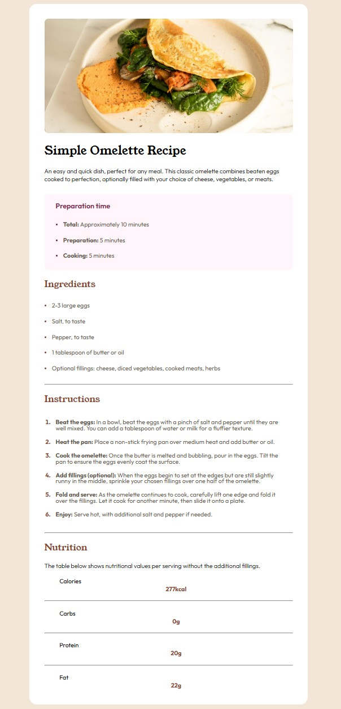

# Frontend Mentor - Recipe page solution

This is a solution to the [Recipe page challenge on Frontend Mentor](https://www.frontendmentor.io/challenges/recipe-page-KiTsR8QQKm). Frontend Mentor challenges help you improve your coding skills by building realistic projects. 

## Table of contents

- [Overview](#overview)
  - [The challenge](#the-challenge)
  - [Screenshot](#screenshot)
  - [Links](#links)
- [My process](#my-process)
  - [Built with](#built-with)
  - [What I learned](#what-i-learned)
  - [Continued development](#continued-development)
  - [Useful resources](#useful-resources)
- [Author](#author)
- [Acknowledgments](#acknowledgments)

## Overview

### Screenshot

### Links

- Solution URL: [https://github.com/Louckoom/Recipe_page]
- Live Site URL: [https://louckoom.github.io/Recipe_page/]
## My process

### Built with

- Semantic HTML5 markup
- CSS custom properties
- Flexbox

### What I learned

I learn more on styling list elements, also importing font properly.

### Continued development

I need to improve on the list part with divider, i didn't manage to archeive a good result. 

### Useful resources

- Responsive layout concept
- Media Query learning

## Author

- Frontend Mentor - [@Louckoom](https://www.frontendmentor.io/profile/Louckoom)
- Twitch - [@LuckyCiel](https://www.twitch.tv/luckyciel)

## Acknowledgments

Did all by myself.
